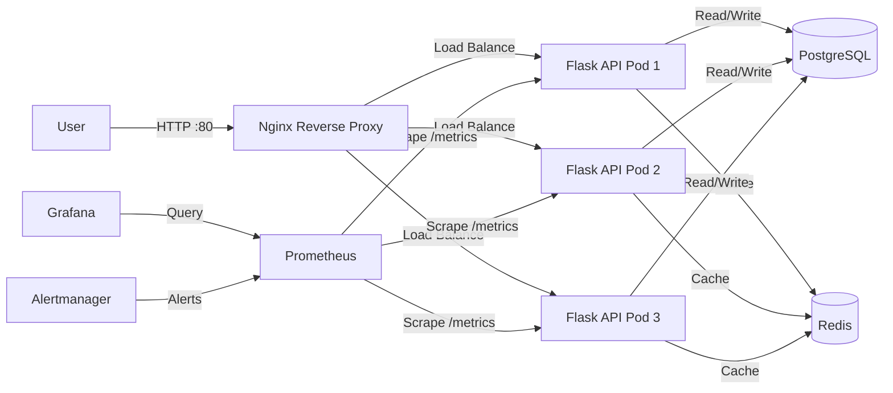

```markdown
# Ziad DevOps 180 — Production Microservices Stack

**Built:** June 2026  
**Stack:** Kubernetes, Helm, Terraform, CI/CD, Observability  
**Constraint:** No cloud access (Algeria banking limitations) — entire stack runs locally with production patterns.

---

## Architecture



---

## Tech Stack

| Layer | Technology | Purpose |
|-------|-----------|---------|
| Reverse Proxy | Nginx | Single entry point, load balancing |
| API | Flask + Python 3.14 | REST API with /health, /logs, /cache, /metrics |
| Database | PostgreSQL 15 | Persistent data with PVC |
| Cache | Redis 7 | Application caching layer |
| Orchestration | Kubernetes (Minikube) | 3-replica deployment, auto-healing |
| Packaging | Helm | One-command full stack deploy |
| IaC | Terraform | AWS production architecture (plan-validated) |
| CI/CD | GitHub Actions | Automated build, lint, template validation |
| Monitoring | Prometheus + Grafana | Custom metrics, latency histograms |
| Security | RBAC + Network Policies + Secrets | Least privilege, default-deny, encrypted credentials |

---

## API Endpoints

| Endpoint | What It Proves |
|----------|---------------|
| GET / | API is running |
| GET /health | Database connectivity + self-healing probes |
| GET /logs | PostgreSQL query + persistent data |
| GET /cache | Redis integration + caching layer |
| GET /metrics | Prometheus custom metrics (requests, latency) |

---

## Quick Start

```bash
# 1. Clone
git clone https://github.com/2nothing4/ziad-devops-180.git
cd ziad-devops-180

# 2. Deploy everything
helm install my-app ./ziad-devops-chart

# 3. Test
kubectl port-forward svc/nginx 8080:80
curl localhost:8080/health
curl localhost:8080/cache
```

---

## What I Built

## Day 1 - COMPLETE
\- \[x] Check Python version: Python 3.14.5
\- \[x] First commit pushed

## Day 2 - COMPLETE
\- \[x] Python script fetches GitHub API
\- \[x] repo_info.json created and pushed

## Day 3 - COMPLETE
\- \[x] WSL installed
\- \[x] Ubuntu terminal working
\- \[x] First Linux commands executed
\- \[x] Created first Linux file: day3-linux.txt

## Day 4 - COMPLETE
\- \[x] Docker Desktop installed
\- \[x] First container ran
\- \[x] Built custom Dockerfile
\- \[x] Containerized Python script

## Day 5 - COMPLETE
\- \[x] Docker Compose installed
\- \[x] Multi-container system running
\- \[x] Python + PostgreSQL connected

## Day 6 - COMPLETE
\- \[x] GitHub Actions workflow created
\- \[x] Automated Docker build on every push
\- \[x] CI/CD pipeline running with GREEN CHECKMARK
\- \[x] Multi-container PostgreSQL + Python test automated

## Day 7 - COMPLETE
\- \[x] Kubernetes cluster running locally (Minikube)
\- \[x] PostgreSQL deployed to Kubernetes
\- \[x] Python app deployed to Kubernetes
\- \[x] App connects to database inside cluster
\- \[x] Fixed psycopg2 dependency and timing issues
\- \[x] Kubernetes manifests stored in repo
\- \[x] Multi-container orchestration working end-to-end

## Day 8 - COMPLETE
\- \[x] Terraform installed
\- \[x] First Infrastructure as Code file created
\- \[x] Nginx web server deployed with code
\- \[x] Server destroyed cleanly with code

## Day 9 - COMPLETE
\- \[x] Flask web application built
\- \[x] Python API connects to PostgreSQL database
\- \[x] Docker image built and loaded into Minikube
\- \[x] Deployed to Kubernetes with service
\- \[x] Application accessible in browser via port-forward
\- \[x] Real web API serving database content
\- \[x] / endpoint: welcome message
\- \[x] /logs endpoint: database query returning JSON

## Day 10 - COMPLETE
\- \[x] Added /health endpoint to Flask app
\- \[x] Health check verifies database connection
\- \[x] Kubernetes livenessProbe configured
\- \[x] Kubernetes readinessProbe configured
\- \[x] Application version bumped to Day 10
\- \[x] Health endpoint returns: {"database": "connected", "status": "healthy"}

## Day 11 - COMPLETE
\- \[x] Prometheus deployed to Kubernetes
\- \[x] Prometheus scraping Flask app health endpoint
\- \[x] Grafana deployed to Kubernetes
\- \[x] Grafana dashboard created showing app health (up=1)
\- \[x] Monitoring stack: Prometheus + Grafana + Flask app
\- \[x] Real-time visualization of application uptime

## Day 12 - COMPLETE
\- \[x] Nginx reverse proxy deployed to Kubernetes
\- \[x] Nginx routes traffic from port 80 to Flask service
\- \[x] Production-grade architecture: Nginx -> Flask -> PostgreSQL
\- \[x] All three layers accessible through single entry point

## Day 13 - COMPLETE
\- \[x] Flask app scaled to 3 replicas
\- \[x] Load balancing across multiple pods
\- \[x] Nginx distributing traffic to 3 Flask instances

## Day 14 - COMPLETE
\- \[x] Redis cache deployed to Kubernetes
\- \[x] Caching layer added to architecture
\- \[x] Core DevOps stack COMPLETE: 14 milestones

## Day 15 - COMPLETE
\- \[x] Helm chart created: ziad-devops-chart/
\- \[x] One command deploys full stack: helm install my-app ./ziad-devops-chart
\- \[x] Stack includes: Nginx, Flask API (3 replicas), PostgreSQL, Redis, Prometheus, Grafana
\- \[x] Tested: curl localhost:8080/cache returns Redis cache data
\- \[x] Day 15: Helm orchestration COMPLETE

## Day 16 - COMPLETE
\- \[x] Kubernetes Secret created for database password
\- \[x] Flask app reads DB password from environment variable
\- \[x] Secret injected into pod via secretKeyRef
\- \[x] No plaintext passwords in repository code
\- \[x] Day 16: Security hardening COMPLETE

## Day 17 - COMPLETE
\- \[x] RBAC configured for API pod
\- \[x] Dedicated ServiceAccount created: api-sa
\- \[x] Role with least privilege: get/list pods only
\- \[x] RoleBinding connects ServiceAccount to Role
\- \[x] API deployment uses serviceAccountName: api-sa
\- \[x] Day 17: Security hardening COMPLETE

## Day 18 - COMPLETE
\- \[x] Network policies configured
\- \[x] Default deny all ingress traffic
\- \[x] Explicit allow: nginx -> api (port 5000)
\- \[x] Explicit allow: api -> postgres (port 5432)
\- \[x] Explicit allow: api -> redis (port 6379)
\- \[x] Day 18: Network security COMPLETE

## Day 19 - COMPLETE
\- \[x] PersistentVolumeClaim created for PostgreSQL
\- \[x] Postgres deployment mounts PVC at /var/lib/postgresql/data
\- \[x] Data survives pod deletion and redeployment
\- \[x] Tested: deleted postgres pod, verified logs data persisted
\- \[x] Day 19: Data persistence COMPLETE

## Day 20 - COMPLETE
\- \[x] GitHub Actions validates Helm chart with helm lint
\- \[x] GitHub Actions renders manifests with helm template
\- \[x] CI/CD pipeline catches syntax errors before deployment
\- \[x] rebuild.sh script automates full local destroy and rebuild
\- \[x] Day 20: CI/CD hardening COMPLETE

## Day 21 - COMPLETE
\- \[x] Terraform module created: terraform/modules/docker-web/
\- \[x] Variables for image name, container name, external port
\- \[x] Outputs for container ID and name
\- \[x] Dev environment calls module with custom values
\- \[x] Day 21: Infrastructure as Code modularity COMPLETE

## Day 22 - COMPLETE
\- \[x] Flask app exposes /metrics endpoint with prometheus-client
\- \[x] Custom metrics: request count and latency histogram
\- \[x] Alertmanager deployed with webhook receiver
\- \[x] Prometheus alert rules: AppDown (critical), HighLatency (warning)
\- \[x] Tested: curl localhost:5000/metrics returns app_requests_total and latency buckets
\- \[x] Day 22: Advanced observability COMPLETE

## Day 23 - COMPLETE
\- \[x] Oracle Cloud Free Tier blocked for Algeria region
\- \[x] LocalStack requires enterprise license (2026)
\- \[x] AWS production architecture defined in Terraform: VPC, EKS, RDS, ElastiCache, IAM
\- \[x] Terraform plan validates 22 resources for full production stack
\- \[x] Documented constraint: regional banking limitations prevent cloud deployment
\- \[x] Architecture targets eu-west-3 (Paris) for French timezone proximity
\- \[x] Day 23: Cloud architecture as code COMPLETE

## Day 24 - COMPLETE
\- \[x] Resource requests and limits added to API pods: 128Mi/256Mi memory, 100m/200m cpu
\- \[x] Resource limits added to Nginx: 64Mi/128Mi memory, 50m/100m cpu
\- \[x] Resource limits added to PostgreSQL: 256Mi/512Mi memory, 100m/200m cpu
\- \[x] Resource limits added to Redis: 64Mi/128Mi memory, 50m/100m cpu
\- \[x] Verified with kubectl describe pod: limits confirmed
\- \[x] Day 24: Production resource management COMPLETE

---

## The 502 Story (Real Debugging)

**Day 15:** Nginx returned 502 Bad Gateway.  
**Root cause:** Service name mismatch — Nginx config pointed to `flask-service`, but the Kubernetes Service was named `api`.  
**Fix:** Updated `proxy_pass` to `http://api`, applied ConfigMap, restarted deployment.  
**Lesson:** Kubernetes DNS resolution is strict. Names must match exactly.

---

## Production Constraints & Honesty

| Constraint | Workaround |
|-----------|-----------|
| No credit card | No AWS/GCP/Azure deployment |
| No PayPal | No cloud billing |
| Algeria region blocked | Oracle Cloud Free Tier unavailable |
| LocalStack paywalled (2026) | Terraform plan validates architecture instead |
| **Result** | Full stack runs locally with production patterns documented |

---

## AWS Production Architecture (Terraform Plan)

When cloud access becomes available, this stack deploys to:

- **VPC** with public/private subnets (eu-west-3 / Paris)
- **EKS Cluster** with managed node groups
- **RDS PostgreSQL** in private subnet
- **ElastiCache Redis** in private subnet
- **Application Load Balancer** with TLS termination
- **IAM Roles** with least privilege

`terraform plan` validates 22 resources. Ready to apply.

---

## Contact

**GitHub:** [@2nothing4](https://github.com/2nothing4)  
**Location:** Algeria (GMT+1, French timezone)  
**Target:** Remote DevOps / Platform Engineer roles (EU startups)

---

Built through documentation-driven learning, iterative debugging, and hands-on implementation.
```

